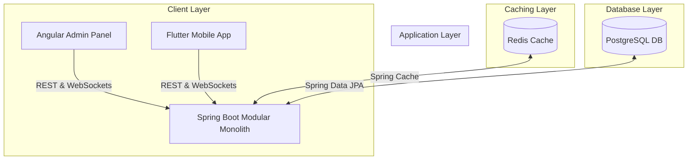

# Siza Restro - Restaurant Table QR Booking & Ordering System

A full-stack, real-time, premium restaurant table booking, menu CRUD, and food ordering management system. The architecture features:
1. **Spring Boot Backend**: REST APIs, PostgreSQL DB, Redis caching, Spring Security + JWT, STOMP WebSockets, and dynamic QR generators.
2. **Angular Admin Panel**: A dashboard for analytics, kitchen order Kanban boards, and tables/menu item CRUD.
3. **Flutter Customer App**: Customer mobile client with table QR scanning (secure UUID lookup), cart ordering, checkout/payment flow, and real-time tracking.

---

## Architecture Diagram



---

## Folder Structure

```text
siza-restro/
├── db/                       # Database scripts
│   ├── schema.sql            # Table schemas (PostgreSQL)
│   └── seed.sql              # Prepopulated mock data
├── backend/                  # Spring Boot 3.3 (Java 21) REST & WebSocket API
├── admin-panel/              # Angular Admin Dashboard UI
└── frontend/                 # Flutter mobile customer application
```

---

## Quick Start with Docker Compose (Recommended)

To run the entire system (Database, Cache, Backend API, and Angular Admin Panel) with a single command, ensure you have **Docker** and **Docker Compose** installed, then run:

```bash
docker compose up --build
```

This starts:
1. **PostgreSQL** on port `5432` (automatically initialized with `schema.sql` and `seed.sql`).
2. **Redis** on port `6379`.
3. **Spring Boot Backend** on port `8080`.
4. **Angular Admin Panel** on port `4200` (mapped to nginx container port `80`).

Access the web apps at:
- **Angular Admin Panel**: [http://localhost:4200](http://localhost:4200)
- **Backend Swagger Docs**: [http://localhost:8080/swagger-ui/index.html](http://localhost:8080/swagger-ui/index.html)
- **Backend base URL**: [http://localhost:8080](http://localhost:8080)

*Default Admin Account:*
- **Username**: `admin`
- **Password**: `admin123`

---

## Local Development Setup

If you prefer to run services individually for local development, follow the guides below.

### 1. Database & Cache Setup

The backend expects a **PostgreSQL** instance and a **Redis** instance.

1. **PostgreSQL Setup**:
   - Create a database named `siza_restro`.
   - Run the initialization scripts:
     ```bash
     psql -U postgres -d siza_restro -f db/schema.sql
     psql -U postgres -d siza_restro -f db/seed.sql
     ```
2. **Redis Setup**:
   - Start a local Redis server on port `6379`.

### 2. Backend Setup & Run

The backend requires **JDK 21** and **Maven**.

1. **Configuration**:
   Open `backend/src/main/resources/application.yml` and adjust the PostgreSQL database and Redis host if they differ from the defaults:
   ```yaml
   spring:
     datasource:
       url: jdbc:postgresql://localhost:5432/siza_restro
       username: postgres
       password: postgres
     data:
       redis:
         host: localhost
         port: 6379
   ```

2. **Run Backend**:
   Navigate to the `backend` directory and start the application:
   ```bash
   mvn spring-boot:run
   ```

### 3. Angular Admin Panel Setup & Run

The admin panel requires **Node.js (v18+)** and **Angular CLI**.

1. **Install Dependencies**:
   ```bash
   cd admin-panel
   npm install
   ```

2. **Run Server**:
   ```bash
   npm run start
   ```
   Open your browser at [http://localhost:4200](http://localhost:4200).

### 4. Flutter Customer App Setup & Run

The Flutter customer app connects to the Spring Boot REST endpoints and STOMP WebSockets.

1. **Install Packages**:
   ```bash
   cd frontend
   flutter pub get
   ```

2. **Device Connection Configuration**:
   - **Android Emulator**: Automatically routes loopback requests to host `10.0.2.2:8080`.
   - **Physical Device**: Find your machine's Wi-Fi IP and update `_localIp` in `frontend/lib/utils/constants.dart`:
     ```dart
     static const String _localIp = '192.168.1.XX';
     ```

3. **Run Application**:
   ```bash
   flutter run
   ```

---

## System Integration & API Contract Details

### Authentication APIs
* `POST /api/auth/login` — Login credentials payload (`username`, `password`). Returns JWT accessToken.
* `POST /api/auth/register` — Create new users (Requires Admin authorization).
* `GET /api/auth/profile` — Get authenticated user details.

### Table & QR Flow APIs
* `POST /api/tables` — Create new table (Requires capacity and table number). Generates secure QR token.
* `GET /api/tables/{id}/qr` — Fetch base64-encoded table QR image.
* `POST /api/booking/scan` — QR lookup. Payload: `{ "qrToken": "secure-uuid-token", "userId": "client-device-id" }`. Returns `BookingModel`.
* `PUT /api/booking/{bookingId}/close` — Mark table session as closed and reset table availability.

### Ordering & Kitchen Flow APIs
* `GET /api/categories` — Fetch all menu categories (Redis cached).
* `GET /api/menu` — Fetch all active menu items.
* `POST /api/order` — Place a food order. Payload:
  ```json
  {
    "bookingId": 1,
    "items": [
      { "menuItemId": 3, "quantity": 2 }
    ],
    "specialInstructions": "No spicy please"
  }
  ```
* `PUT /api/order/{orderId}/status` — Update order status. Valid status: `WAITING`, `PREPARING`, `READY`, `SERVED`, `CANCELLED`. Broadcasts real-time events.

### Payment Flow APIs
* `POST /api/payments` — Process order payment. Payload:
  ```json
  {
    "orderId": 1,
    "paymentMethod": "DIGITAL_WALLET",
    "amount": 25.50
  }
  ```

---

## Real-Time WebSocket Protocols (STOMP Broker)

All client-server messages are processed via Spring's STOMP broker at endpoint `ws://localhost:8080/ws`.

1. **Global Kitchen Channels** (Subscribed by Angular Admin):
   - `/topic/orders` — Publishes orders created, updated, or paid. Allows the Kanban board to reflect status instantly.

2. **Table-Specific Channels** (Subscribed by Flutter Customer App):
   - `/topic/booking/{bookingId}` — Publishes status changes of orders corresponding to the customer's current session.
   - `/topic/booking/{bookingId}/notifications` — Publishes localized in-app notifications (e.g. *"Your Starter has been served!"*).
