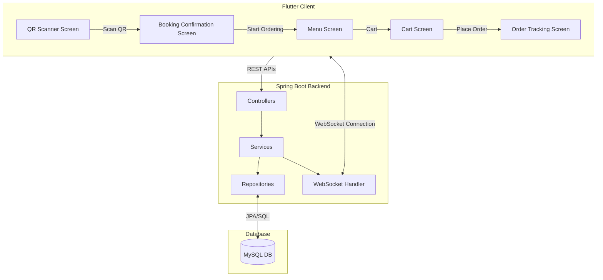

# Implementation Plan - Restaurant QR Table Booking & Ordering System

This document outlines the detailed architecture, database design, directory structure, API contracts, and implementation steps for building the restaurant QR table booking and ordering system.

## Proposed System Architecture

The application will consist of:
1. **Backend**: Spring Boot 3.3+ (Java 21) with Spring Web, Spring Data JPA, Spring WebSocket, and MySQL Driver.
2. **Frontend**: Flutter (latest stable) mobile app using Riverpod for state management, Dio for HTTP requests, and `mobile_scanner` for QR scanning.
3. **Database**: MySQL (running locally on port 3306).



---

## User Review Required

Please review the database connection credentials and port configuration:
> [!IMPORTANT]
> The MySQL server on your machine was detected running on port `3306`. By default, the application will be configured to connect to `jdbc:mysql://localhost:3306/siza_restro` with username `root` and password `root` (or empty). If your credentials differ, please let me know or modify `application.yml` after creation.

> [!NOTE]
> We will configure cross-origin resource sharing (CORS) on the backend to allow requests from any origin (`*`) to facilitate easy testing from mobile devices, Android emulators, and local web builds.

---

## Open Questions
- **MySQL Password**: Do you have a specific password configured for your local MySQL `root` user?
- **Booking Expiry**: Would you like to implement the booking auto-expiry feature in this version, e.g., using a Spring Scheduled task that frees the table if no order is placed within 15 minutes of booking?

---

## Proposed Changes

We will create two main directories in the workspace:
1. `backend/` for the Spring Boot service.
2. `frontend/` for the Flutter application.

### 1. Database Schema

The database `siza_restro` will be created with the following tables:

```sql
CREATE DATABASE IF NOT EXISTS siza_restro;
USE siza_restro;

CREATE TABLE IF NOT EXISTS tables (
    id BIGINT AUTO_INCREMENT PRIMARY KEY,
    table_number VARCHAR(50) NOT NULL UNIQUE,
    status VARCHAR(20) NOT NULL DEFAULT 'AVAILABLE' -- AVAILABLE, BOOKED
);

CREATE TABLE IF NOT EXISTS bookings (
    id BIGINT AUTO_INCREMENT PRIMARY KEY,
    table_id BIGINT NOT NULL,
    user_id VARCHAR(100) NOT NULL, -- Device ID or guest session ID
    status VARCHAR(20) NOT NULL DEFAULT 'ACTIVE', -- ACTIVE, CLOSED
    created_at TIMESTAMP DEFAULT CURRENT_TIMESTAMP,
    FOREIGN KEY (table_id) REFERENCES tables(id)
);

CREATE TABLE IF NOT EXISTS menu_items (
    id BIGINT AUTO_INCREMENT PRIMARY KEY,
    name VARCHAR(100) NOT NULL,
    description TEXT,
    price DECIMAL(10, 2) NOT NULL,
    category VARCHAR(50) NOT NULL, -- STARTERS, MAIN_COURSE, DRINKS, DESSERTS
    is_available BOOLEAN NOT NULL DEFAULT TRUE
);

CREATE TABLE IF NOT EXISTS orders (
    id BIGINT AUTO_INCREMENT PRIMARY KEY,
    booking_id BIGINT NOT NULL,
    status VARCHAR(20) NOT NULL DEFAULT 'PENDING', -- PENDING, PREPARING, READY, SERVED
    total_amount DECIMAL(10, 2) NOT NULL,
    created_at TIMESTAMP DEFAULT CURRENT_TIMESTAMP,
    FOREIGN KEY (booking_id) REFERENCES bookings(id)
);

CREATE TABLE IF NOT EXISTS order_items (
    id BIGINT AUTO_INCREMENT PRIMARY KEY,
    order_id BIGINT NOT NULL,
    menu_item_id BIGINT NOT NULL,
    quantity INT NOT NULL,
    price DECIMAL(10, 2) NOT NULL,
    FOREIGN KEY (order_id) REFERENCES orders(id),
    FOREIGN KEY (menu_item_id) REFERENCES menu_items(id)
);
```

---

### 2. Backend Component (`backend/`)

We will scaffold a Spring Boot 3.x project with Maven wrappers and source files.

#### [NEW] [pom.xml](file:///c:/FONEPAY/RESEARCH/CloudSicle/siza-restro/backend/pom.xml)
Maven configuration file with dependencies:
- `spring-boot-starter-web` (REST APIs)
- `spring-boot-starter-data-jpa` (Database ORM)
- `spring-boot-starter-websocket` (Real-time updates)
- `mysql-connector-j` (MySQL connection driver)
- `lombok` (Boilerplate reduction)

#### [NEW] [application.yml](file:///c:/FONEPAY/RESEARCH/CloudSicle/siza-restro/backend/src/main/resources/application.yml)
Configuration containing datasource URL, username, password, JPA properties (hibernate ddl-auto: update), and server configurations.

#### [NEW] [Entities & DTOs](file:///c:/FONEPAY/RESEARCH/CloudSicle/siza-restro/backend/src/main/java/com/sizarestro/entity)
Entities representing the database tables:
- `TableEntity.java`
- `Booking.java`
- `MenuItem.java`
- `Order.java`
- `OrderItem.java`

And corresponding DTOs for requests and responses (e.g., `ScanRequest.java`, `BookingResponse.java`, `OrderRequest.java`, `OrderStatusUpdateRequest.java`).

#### [NEW] [Repositories](file:///c:/FONEPAY/RESEARCH/CloudSicle/siza-restro/backend/src/main/java/com/sizarestro/repository)
Interfaces extending `JpaRepository`:
- `TableRepository.java`
- `BookingRepository.java`
- `MenuItemRepository.java`
- `OrderRepository.java`

#### [NEW] [Services](file:///c:/FONEPAY/RESEARCH/CloudSicle/siza-restro/backend/src/main/java/com/sizarestro/service)
Business logic implementation:
- `BookingService.java` - Scans and reserves tables, validates active bookings.
- `MenuService.java` - Manages and lists food menu.
- `OrderService.java` - Places orders, processes details, and updates order status.

#### [NEW] [WebSocket Config & Handler](file:///c:/FONEPAY/RESEARCH/CloudSicle/siza-restro/backend/src/main/java/com/sizarestro/websocket)
- `WebSocketConfig.java` - Registers WebSocket endpoint `/ws/orders` with CORS allowed.
- `OrderWebSocketHandler.java` - Tracks active customer sessions and broadcasts order status changes.

#### [NEW] [Controllers](file:///c:/FONEPAY/RESEARCH/CloudSicle/siza-restro/backend/src/main/java/com/sizarestro/controller)
- `BookingController.java` - Exposes booking scanning endpoint (`/api/booking/scan`) and booking status query (`/api/booking/{bookingId}`).
- `MenuController.java` - Exposes menu endpoint (`/api/menu`).
- `OrderController.java` - Exposes order submission, retrieval, and status update endpoints (`/api/order`, `/api/order/{orderId}`, `/api/order/booking/{bookingId}`, `/api/order/{orderId}/status`).

---

### 3. Frontend Component (`frontend/`)

We will initialize a clean Flutter project structure using Flutter 3.41+ and Dart 3.x.

#### [NEW] [pubspec.yaml](file:///c:/FONEPAY/RESEARCH/CloudSicle/siza-restro/frontend/pubspec.yaml)
Project configuration with dependencies:
- `flutter_riverpod` (State management)
- `dio` (HTTP client)
- `mobile_scanner` (QR scanning functionality)
- `web_socket_channel` (WebSocket communication)
- `google_fonts` (Modern typography)

#### [NEW] [Services](file:///c:/FONEPAY/RESEARCH/CloudSicle/siza-restro/frontend/lib/services)
- `api_service.dart` - Handles all REST API communication with standard headers and error handling.
- `websocket_service.dart` - Connects to `/ws/orders` and listens for real-time status updates of active orders.

#### [NEW] [Providers](file:///c:/FONEPAY/RESEARCH/CloudSicle/siza-restro/frontend/lib/providers)
- `booking_provider.dart` - Manages current booking details, guest session ID, and active table.
- `menu_provider.dart` - Fetches and categorizes the restaurant menu.
- `cart_provider.dart` - Manages adding, removing, and updating item quantities in the cart, along with total calculation.
- `order_provider.dart` - Places order and manages active order list, tracking statuses.

#### [NEW] [Screens](file:///c:/FONEPAY/RESEARCH/CloudSicle/siza-restro/frontend/lib/screens)
- `qr_scanner_screen.dart` - Camera scanner view to read QR codes containing `tableId` (e.g. `siza-restro://table/2` or simple `tableId=2`).
- `booking_confirmation_screen.dart` - Visual feedback with table number, time, and a "Start Ordering" action button.
- `menu_screen.dart` - Clean, responsive UI with categories (Starters, Main Course, Drinks, Desserts), search, and item cards with quick add/remove. Includes a floating cart summary button.
- `cart_screen.dart` - Displays selected items, lets user update quantities, and displays the "Place Order" button.
- `order_tracking_screen.dart` - Real-time tracking of order status (Pending -> Preparing -> Ready -> Served) using a timeline/stepper and live WebSocket updates.

---

## Verification Plan

### Automated/Local Tests
- **Database setup verification**: Create the schema and seed standard data.
- **REST API testing**: Validate endpoints using backend test cases or curl/Postman requests.
- **WebSocket connection check**: Verify status broadcasts work when orders are updated.

### Manual Verification
1. **Mock QR Scanning**: Allow entering `tableId` manually in the scanning view for easy testing on emulators/simulators where camera access might not be configured.
2. **Order Placement & Status Flow**: Place an order from the client, use the Admin endpoint to transition order from `PENDING -> PREPARING -> READY -> SERVED`, and verify the Flutter UI transitions dynamically in real-time.
